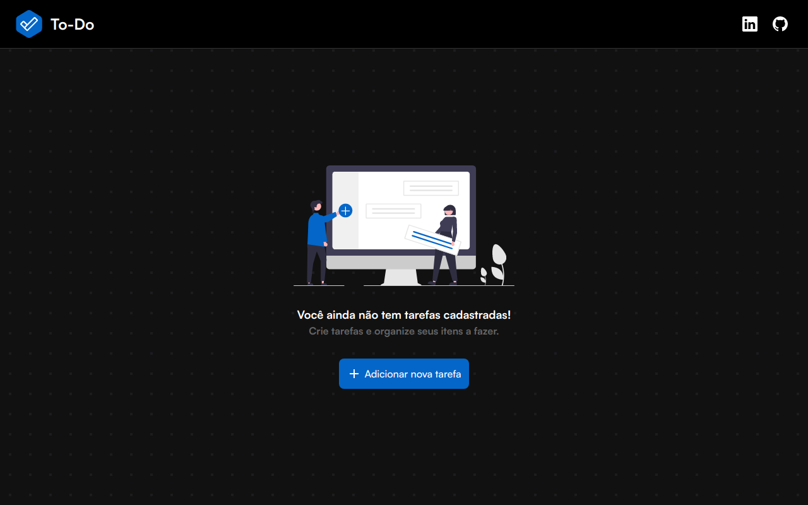

<h1>
  To-Do List
</h1>

Front-end do apliativo desenvolvido na Jornada Ignite [Rocketseat Ignite](https://www.rocketseat.com.br/ignite).

## Características

Este front-end apresenta as ferramentas e práticas mais recentes em desenvolvimento web!

- ⚛️ **React** — Uma biblioteca para construir interfaces de usuário
- 🧁 **CSS** — Vanilla Extract
- ⚡️ **Crakra UI** - Framework de componentes
- 💖 **Lint** — ESlint/Prettier/Editor Config

Eu usei outras bibliotecas tambem, como **date-fns** para datas.

## Projeto 

Nesse projeto, foi desenvolvido uma aplicação de controle de tarefas no estilo **to-do list**, que contém as seguintes funcionalidades:

- Adicionar uma nova tarefa
- Marcar e desmarcar uma tarefa como concluída
- Editar ou remover uma tarefa da listagem
- Mostrar lista de tarefas pendentes e concluídas
